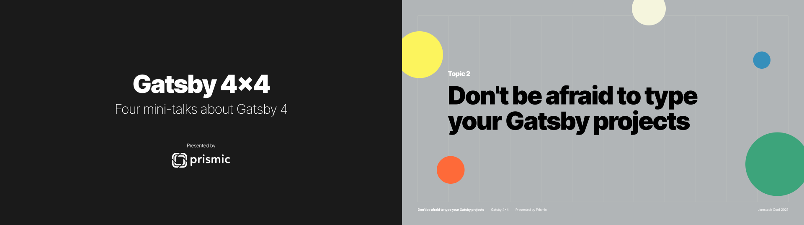

# Gatsby 4×4 - TypeScript code generation demo

This repository contains a basic setup to support automatic TypeScript support for your Gatsby pages' data.

[GraphQL Code Generator][gql-codegen] is used to read your source files and generate TypeScript types for each GraphQL query it finds. You can then use those types within your templates and components.

This repository is a companion to one of four talks shown during [Prismic][prismic]'s **Gatsby 4×4** presentation at [Jamstack Conf 2021][jamstackconf].

[**Learn more on the Prismic blog**][prismic-blog]



## How to try this yourself

1. Clone the repository.
2. Open `src/templates/blogPost.tsx` in an editor that supports TypeScript. [VS Code][vscode] works out of the box.
3. Use the `data` prop. You should see autocomplete when typing properties that are nested in `data`.

If you want to test regenerating the types:

1. Start the Gatsby development server.

   ```sh
   npm run develop
   ```

2. Edit your GraphQL query to request additional data.

3. Once bootstrapped, run GraphQL Code Generator.

   ```sh
   npm run gen
   ```

4. Once the types are regenerated, go back into `src/templates/blogPost.tsx`. You should see the properties you added as part of the `data` prop via autocomplete.

This is an easy way to ensure you are using the right data properties within your app. If you like the guidance this provides for your `data` prop, look into adopting TypeScript throughout other parts of your React app.

Have fun! 😊

## License

```
Copyright 2013-2021 Prismic <contact@prismic.io> (https://prismic.io)

Licensed under the Apache License, Version 2.0 (the "License");
you may not use this file except in compliance with the License.
You may obtain a copy of the License at

    http://www.apache.org/licenses/LICENSE-2.0

Unless required by applicable law or agreed to in writing, software
distributed under the License is distributed on an "AS IS" BASIS,
WITHOUT WARRANTIES OR CONDITIONS OF ANY KIND, either express or implied.
See the License for the specific language governing permissions and
limitations under the License.
```

<!-- Links -->

[prismic]: https://prismic.io
[prismic-blog]: https://prismic.io/blog
[gql-codegen]: https://www.graphql-code-generator.com/
[jamstackconf]: https://jamstackconf.com/
[vscode]: https://code.visualstudio.com/
